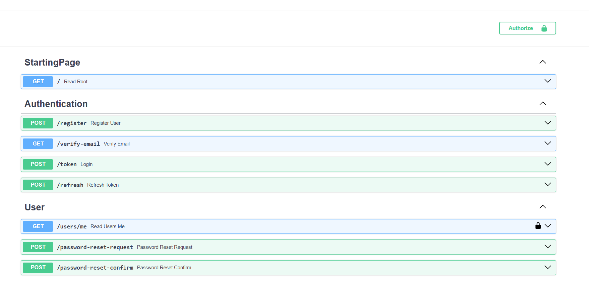

## 🚀 FastAPI OAuth2 Auth App

A simple and secure FastAPI application implementing **OAuth2 with JWT**, user data stored in **MySQL**, and a rendered HTML homepage using **Jinja2 templates**.

---

## 🔒 Project Screenshots





### 📁 Features

* 🔐 OAuth2 password flow authentication
* 🔑 JWT token generation and validation
* 🧑‍💻 User data fetched from **MySQL**
* 📄 HTML landing page rendered using Jinja2
* 🧭 Protected routes using JWT token
* 🎯 Modern, responsive UI homepage
* 🔗 Footer with dynamic year, GitHub & LinkedIn links

---

### 🏁 Getting Started

#### 1. Clone the repository

```bash
git clone https://github.com/SujayKumarMondal/FastAPI-OAuth2.git
```

#### 2. Install dependencies

```bash
pip install -r requirements.txt
```

#### 3. Setup MySQL

Create your schema and table in MySQL Workbench:

```

> 💡 You can insert/update/delete users directly using MySQL Workbench.

---

### 🔐 Authentication Flow

* First, authorize using the **username and password**.
* Only users with valid **Google OAuth Client ID and Secret** (already stored or validated in your app logic) can log in.
* If you don’t have these, generate them from the [Google Cloud Console](https://console.cloud.google.com/).

---

### 📄 Endpoints

| Method | Endpoint          | Description                             |
| ------ | ----------------- | --------------------------------------- |
| POST   | `/token`          | Get JWT token using username & password |
| GET    | `/users/me`       | Get current logged-in user info         |
| GET    | `/users/me/items` | Get dummy items (protected route)       |
| GET    | `/`               | Renders the `index.html` homepage       |

---

### 🌐 Homepage

Access your app at below or you can modify the host & port:

```bash
http://localhost:7001/
```

The root page renders `index.html`, which shows documentation, useful links, and info about the auth flow. The footer includes dynamic year and links to your GitHub & LinkedIn.

---

---

### 📜 License

This project is licensed under the **MIT License**. See the [LICENSE](./LICENSE) file for details.

---

### 🔗 Author Links

* [💼 LinkedIn](https://www.linkedin.com/in/sujay-kumar-mondal-a125481b7/)
* [🔗 GitHub](https://github.com/SujayKumarMondal)

---

